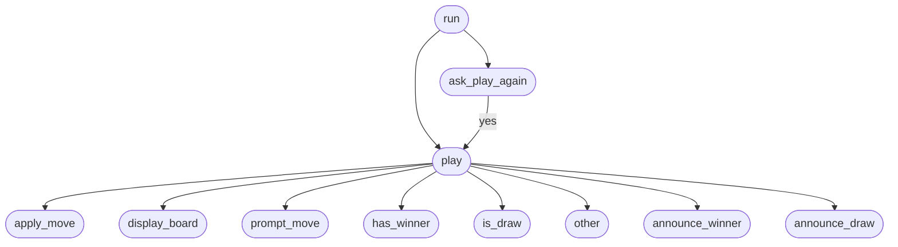

# Tic Tac Toe (Terminal)

A two-player Tic Tac Toe game for the terminal, built with plain Python and decomposed into separate modules.

## Top-Down Design

Top-down design breaks the program into smaller parts, starting from `run` at the top and working down to the lowest-level tasks. Arrows show which part calls or uses another.

### Top-Down Design Diagram



### How to Read the Diagram

| Level | Methods | File |
|-------|---------|------|
| 1 | `run` | `main.py` |
| 2 | `play`, `ask_play_again` | `game.py` / `terminal.py` |
| 3 | `display_board`, `prompt_move`, `announce_winner`, `announce_draw` | `terminal.py` |
| 4 | `apply_move`, `has_winner`, `is_draw`, `other` | `board.py` / `player.py` |

After each game, `run` calls `ask_play_again`. If the player chooses **yes**, the flow returns to `play` and starts a new match.

### Design Benefits

- **Maintainable** — each file has one clear role
- **Scalable** — new features (e.g. AI opponent) can be added without changing unrelated code
- **Easy to read** — follow the arrows from `run` down to see how the program is built step by step

## Files

| File | Purpose |
|------|---------|
| `main.py` | `TicTacToeApp` entry point and replay loop |
| `game.py` | `TicTacToeGame` single-match logic |
| `terminal.py` | `TerminalUI` display and input |
| `board.py` | `Board` grid and rules |
| `player.py` | `Player` symbol and turn switching |

## Run

```bash
python main.py
```

## How to Play

1. Player **X** goes first, then players alternate with **O**.
2. Enter a move as row and column numbers from 1 to 3 (e.g. `2 2` or `2,2`).
3. The first player to get three in a row — horizontally, vertically, or diagonally — wins.
4. If the board fills with no winner, the game is a draw.
5. After each game, choose whether to play again.

## Example Board

```
    1   2   3
  +---+---+---+
1 | X | O |   |
  +---+---+---+
2 |   | X |   |
  +---+---+---+
3 | O |   |   |
  +---+---+---+
```

## Code Quality

Run [Pylint](https://pylint.readthedocs.io/) to check code style and conventions:

```bash
pylint main.py
```

To lint all project files:

```bash
pylint main.py board.py player.py game.py terminal.py
```
