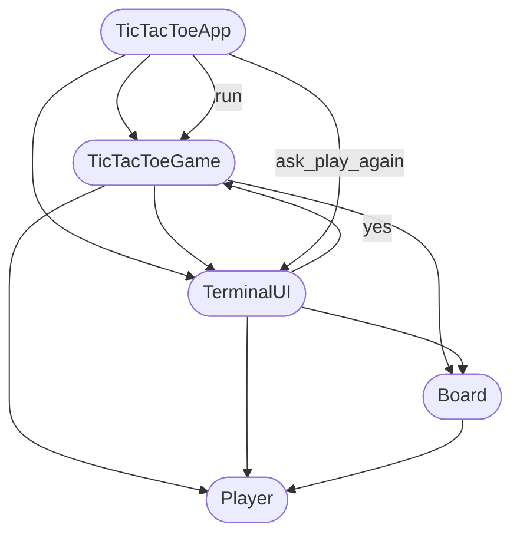

# Tic Tac Toe (Terminal)

A two-player Tic Tac Toe game for the terminal, built with plain Python using an object-oriented design.

## Object-Oriented Design

The program is split into classes, each with a single responsibility. Arrows show which class creates or uses another.

### Class Diagram



### How to Read the Diagram

| Class | Responsibility | File |
|-------|----------------|------|
| `TicTacToeApp` | Entry point, welcome/goodbye, replay loop | `main.py` |
| `TicTacToeGame` | Single-match game loop | `game.py` |
| `TerminalUI` | Board display, input, and messages | `terminal.py` |
| `Board` | Grid state, moves, win/draw checks | `board.py` |
| `Player` | Player symbol and turn switching | `player.py` |

After each game, `TicTacToeApp` calls `ask_play_again`. If the player chooses **yes**, `TicTacToeGame.play()` runs again for a new match.

### Design Benefits

- **Encapsulation** — board state and rules live inside `Board`
- **Maintainable** — each class has one clear role
- **Scalable** — new features (e.g. AI opponent) can be added as new classes without changing unrelated code
- **Easy to test** — game logic can be tested separately from terminal I/O

## Files

| File | Purpose |
|------|---------|
| `main.py` | `TicTacToeApp` entry point and replay loop |
| `game.py` | `TicTacToeGame` single-match logic |
| `terminal.py` | `TerminalUI` display and input |
| `board.py` | `Board` grid and rules |
| `player.py` | `Player` symbol and turn switching |

## Run

```bash
python main.py
```

## How to Play

1. Player **X** goes first, then players alternate with **O**.
2. Enter a move as row and column numbers from 1 to 3 (e.g. `2 2` or `2,2`).
3. The first player to get three in a row — horizontally, vertically, or diagonally — wins.
4. If the board fills with no winner, the game is a draw.
5. After each game, choose whether to play again.

## Example Board

```
    1   2   3
  +---+---+---+
1 | X | O |   |
  +---+---+---+
2 |   | X |   |
  +---+---+---+
3 | O |   |   |
  +---+---+---+
```

## Code Quality

Run [Pylint](https://pylint.readthedocs.io/) to check code style and conventions:

```bash
pylint main.py
```

To lint all project files:

```bash
pylint main.py board.py player.py game.py terminal.py
```
