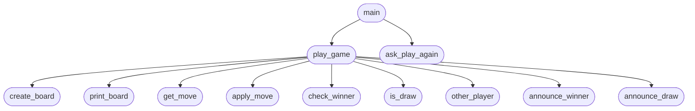

# Tic Tac Toe (Terminal)

A two-player Tic Tac Toe game for the terminal, built with plain Python and decomposed into separate modules.

## Top-Down Design

Top-down design breaks the program into smaller functions, starting from `main` at the top and working down to the lowest-level tasks. Arrows show which function calls or uses another.

### Top-Down Design Diagram



### How to Read the Diagram

| Level | Functions | File |
|-------|-----------|------|
| 1 | `main` | `main.py` |
| 2 | `play_game` | `game.py` |
| 2 | `ask_play_again`, `print_board`, `get_move`, `announce_winner`, `announce_draw` | `ui.py` |
| 3 | `create_board`, `apply_move`, `check_winner`, `is_draw`, `other_player` | `board.py` |

### Design Benefits

- **Maintainable** — each file has one clear role
- **Scalable** — new features (e.g. AI opponent) can be added without changing unrelated code
- **Easy to read** — follow the arrows from `main` down to see how the program is built step by step

## Files

| File | Purpose |
|------|---------|
| `main.py` | Entry point and replay loop |
| `game.py` | Single-match game loop |
| `ui.py` | Board display, input, and messages |
| `board.py` | Board state, moves, and win/draw rules |

## Run

```bash
python main.py
```

## How to Play

1. Player **X** goes first, then players alternate with **O**.
2. Enter a move as row and column numbers from 1 to 3 (e.g. `2 2` or `2,2`).
3. The first player to get three in a row — horizontally, vertically, or diagonally — wins.
4. If the board fills with no winner, the game is a draw.
5. After each game, choose whether to play again.

## Example Board

```
    1   2   3
  +---+---+---+
1 | X | O |   |
  +---+---+---+
2 |   | X |   |
  +---+---+---+
3 | O |   |   |
  +---+---+---+
```
