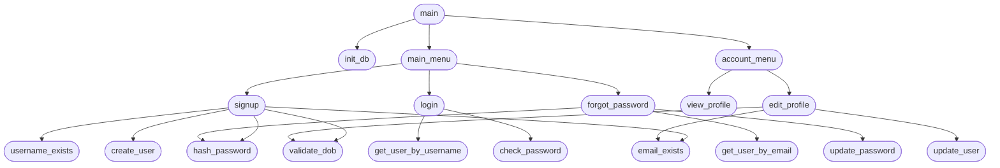

# Login & Signup System (Terminal)

A simple plain-Python account system with signup, login, profile management, and forgot password.

## Top-Down Design

Top-down design breaks the program into smaller functions, starting from `main` at the top and working down to the lowest-level tasks. Arrows show which function calls or uses another.

### Top-Down Design Diagram



### How to Read the Diagram

| Level | Functions | File |
|-------|-----------|------|
| 1 | `main` | `main.py` |
| 2 | `init_db`, `main_menu`, `account_menu` | `main.py` / `storage.py` |
| 3 | `signup`, `login`, `forgot_password`, `view_profile`, `edit_profile` | `auth.py` |
| 4 | `validate_dob`, `hash_password`, `check_password`, database functions | `auth.py` / `storage.py` |

### Design Benefits

- **Maintainable** — each file has one clear role
- **Scalable** — new features (e.g. delete account) can be added without changing unrelated code
- **Easy to read** — follow the arrows from `main` down to see how the program is built step by step

## Files

| File | Purpose |
|------|---------|
| `main.py` | Menu and program entry point |
| `auth.py` | Signup, login, profile, forgot password |
| `storage.py` | SQLite database for user accounts |

## Run

```bash
python main.py
```

Create the database manually (optional):

```bash
python storage.py create
```

## Features

- **Sign Up** — username, email, password, full name, date of birth
- **Login** — username and password
- **Forgot Password** — reset via email code (printed to terminal for demo)
- **Profile** — view and edit full name, date of birth, email

User data is stored in `users.db` (created automatically on first run).
