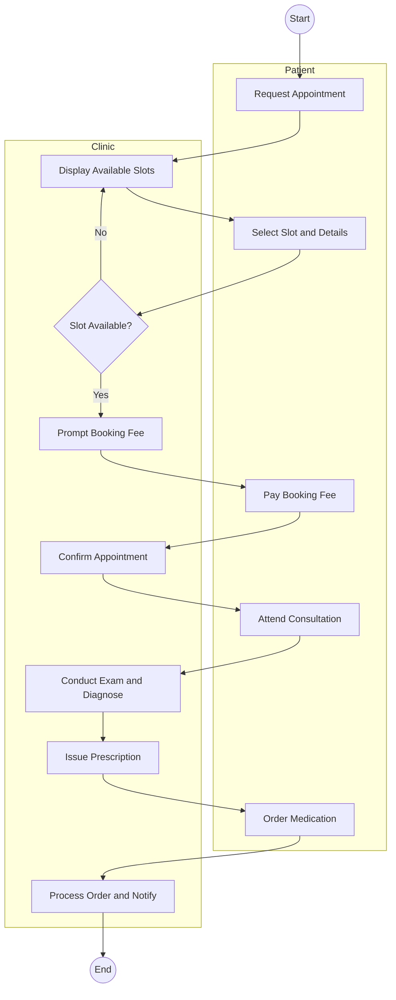

# Clinic System Activity Diagram

This activity diagram represents a clinic system where a patient can book an appointment, pay the booking fee, and order medication after consultation.

## Activity Diagram (Mermaid)

## Brief Description

- The diagram is organized into two lanes: `Patient` and `Clinic`.
- The patient requests an appointment and selects a slot, while the clinic checks availability.
- If no slot is available, the flow loops back to displaying available slots.
- When available, the clinic prompts for payment and confirms the appointment after fee payment.
- After consultation and prescription, the patient orders medication and the clinic processes the order before ending the workflow.
